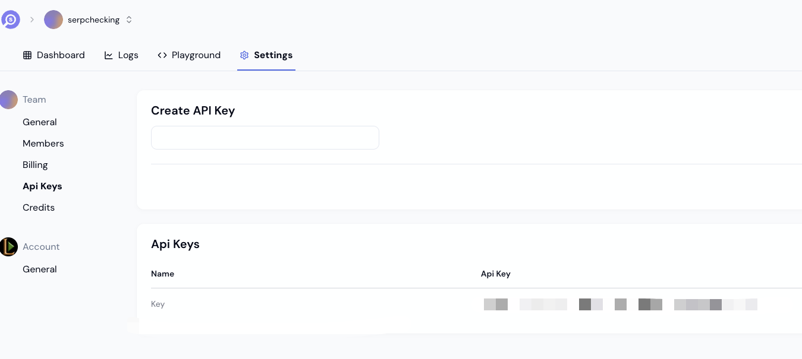

# SERP Checker

Analyze SERPs from 230+ Countries with SERP Checking

SERP Checking offers a powerful, free SERP checker designed to give you comprehensive insights into Google's search engine results pages (SERPs) for any keyword. Our tool stands out with unparalleled global coverage and detailed analysis of SERP features and Rich Results.

## Get Your SERP API KEY

To access the SERP API and start making requests, you'll need your API key. Follow these steps to get your key:

1. **Visit the SERP API Website:**
   Go to the SERP API website at [SERPING](https://www.serp.ing/) to sign up or log in to your account.

2. **Obtain Your API Key:**
   After logging in, navigate to the [API section](https://www.serp.ing/app/settings/team/tokens) or dashboard to find your unique API key. This key will be required to authenticate your API requests.




3. **Use Your API Key:**
   Once you have your API key, you can use it in your requests to the SERP API. Set the key in your environment variable or directly in your code as shown below:


```sh
SERPING_US_EAST_1_API_KEY=your_serping_api_key
```

## Getting Started

First, run the development server:

```bash
npm run dev
# or
yarn dev
# or
pnpm dev
# or
bun dev
```

## Learn More

To learn more about Next.js, take a look at the following resources:

- [Next.js Documentation](https://nextjs.org/docs) - learn about Next.js features and API.
- [Learn Next.js](https://nextjs.org/learn) - an interactive Next.js tutorial.

You can check out [the Next.js GitHub repository](https://github.com/vercel/next.js/) - your feedback and contributions are welcome!

## Deploy on Vercel

You can deploy this project to Vercel with the following button:

[](https://vercel.com/import/project?template=https://github.com/serping/serp-checker)
